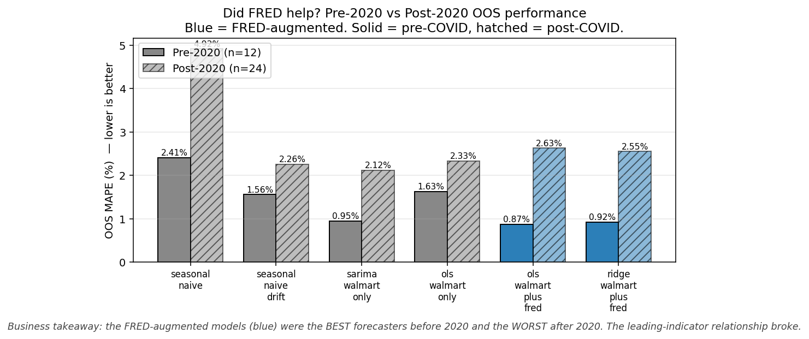
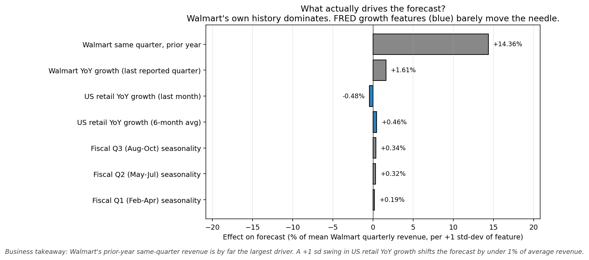
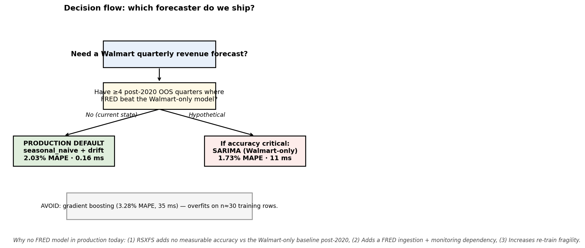

# Does FRED retail sales help forecast Walmart's quarterly revenue?

**Audience:** portfolio manager  ·  **OOS window:** FY18-Q1 → FY26-Q4 (n = 36, rolling-origin CV)
**Companion:** `INSIGHTS.md` (long-form analyst notes); `prompts.md` (LLM prompt log)

## The short answer

**No, not in the regime that matters.** On the strict apples-to-apples test — adding FRED features to a regression that already has Walmart's own history — FRED produces no measurable out-of-sample accuracy gain. The strongest FRED-augmented model (Ridge regression) gets **2.01% MAPE**, statistically indistinguishable from a no-FRED seasonal-naive baseline with trailing drift (**2.03% MAPE**). The strongest Walmart-only model (SARIMA) wins outright at **1.73% MAPE**.

But the picture sharpens dramatically when we split the out-of-sample window on the pandemic. FRED was a useful leading indicator **before 2020** and **stopped working after**:

**Falsifiable claim:** *Adding FRED RSXFS does not improve out-of-sample Walmart quarterly revenue forecasts over a Walmart-only SARIMA on 2017-Q1 → 2026-Q4, and is strictly worse on the 24 OOS quarters since 2020-Q1. We would revisit if 4+ more clean post-stimulus quarters showed FRED-augmented models recovering — or if a Walmart-specific retail sub-series replaced the aggregate RSXFS.*

## Why FRED looks weak

The feature-impact chart from the Ridge model makes the point in one picture: Walmart's own prior-year revenue moves the forecast by **+14.36% of average revenue per +1 standard-deviation move**. The strongest FRED feature moves it by **−0.48%**. There is very little marginal information left for FRED to add once you've conditioned on Walmart's own history and fiscal-quarter seasonality.

## What we worry about

1. **n = 36 OOS quarters is small.** Pre-/post-2020 sub-samples are 12 and 24 — the regime split is suggestive, not statistically airtight. Don't bet the model on it.
2. **FRED RSXFS in this file is seasonally adjusted; Walmart revenue is not.** We compare YoY-on-YoY to remove the asymmetry, but residual bias is plausible.
3. **The publication-lag convention matters.** We hold FRED back by ≥1 calendar month relative to the target quarter end, mirroring real-time availability. Shortening that lag would flatter FRED's apparent performance — and would not survive production.
4. **GBR underperformed every non-trivial model.** Classic small-sample failure mode. We kept it in the table because the customer asked whether more-complex models help; the answer is no.

## Production recommendation

**Ship `seasonal_naive + drift`** as the system-of-record forecaster: 2.03% MAPE, ~0.16 ms / forecast, no statsmodels, no sklearn, no FRED dependency. To buy the extra 0.30 pp of MAPE SARIMA offers, you take on a statsmodels dependency and ~70× the latency, with re-estimation that can be unstable in volatile regimes. **Do not ship any FRED-augmented model on this evidence.**

Full numbers, paired tests, regime tables, the production tradeoff matrix and the open follow-up questions are in `INSIGHTS.md` and `analysis.ipynb`.
