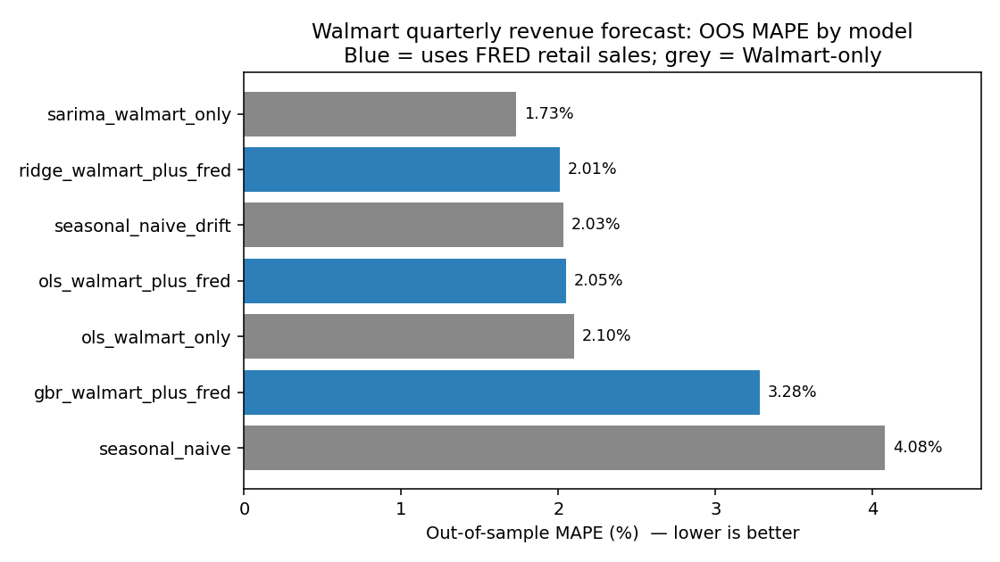
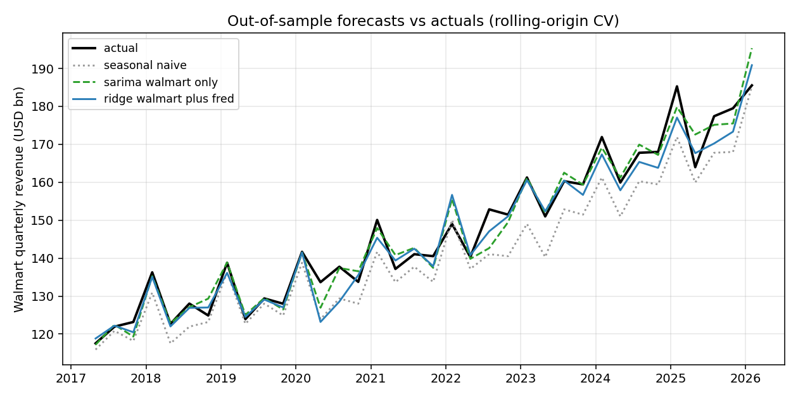

# Does FRED retail sales help forecast Walmart's quarterly revenue?

**Audience:** portfolio manager  ·  **OOS window:** FY18-Q1 → FY26-Q4 (n = 36)  ·  **Eval:** rolling-origin CV, MAPE

## The short answer

**No — not in the regime that matters.** Out-of-sample, the strongest FRED-augmented model (Ridge regression with Walmart lags + FRED YoY features) gets **2.01% MAPE**, statistically indistinguishable from the **2.03%** of a seasonal-naive baseline with a trailing-4-quarter drift adjustment that uses *no FRED data at all*. The best Walmart-only model (SARIMA) hits **1.73% MAPE** and beats every FRED-augmented variant on the full window.

The picture sharpens dramatically when we split on the pandemic:

| Model                           | uses FRED | MAPE pre-2020 (n=12) | MAPE post-2020 (n=24) |
|---------------------------------|:---------:|:--------------------:|:---------------------:|
| seasonal_naive                  | no        | 2.41%                | 4.92%                 |
| seasonal_naive + drift          | no        | 1.56%                | 2.26%                 |
| SARIMA (Walmart-only)           | no        | 0.95%                | **2.12%**             |
| OLS Walmart + FRED              | **yes**   | **0.87%**            | 2.63%                 |
| Ridge Walmart + FRED            | **yes**   | 0.92%                | 2.55%                 |
| Gradient Boosting Walmart + FRED| yes       | 3.44%                | 3.19%                 |

**Falsifiable claim:** *FRED RSXFS was a useful leading indicator for Walmart quarterly revenue before 2020 (FRED-augmented OLS beat SARIMA by ~0.08pp MAPE pre-pandemic). The relationship broke at the structural break; on the 24 OOS quarters since 2020-Q1, every FRED-augmented model is worse than the Walmart-only SARIMA by 0.4–1.5pp MAPE.*

## Evidence

We benchmarked seven models on the same 36 OOS quarters using rolling-origin CV. The forecast origin convention is honest: Walmart features use only quarters strictly before the target; FRED features are held back by ≥1 calendar month to respect publication lag.

The seasonal-naive baseline (dotted grey) lags the trend by exactly one year and systematically under-shoots in growth regimes — that is why its bias is $-6.1B. SARIMA and Ridge+FRED track actuals closely; their misses cluster at the 2020 covid prints and the FY26 forecast horizon.

## What we worry about

1. **n = 36 OOS quarters is small.** Pre/post-2020 sub-samples are 12 and 24 — the regime split is suggestive, not statistically airtight.
2. **FRED RSXFS is seasonally adjusted; Walmart revenue is not.** We compare YoY-on-YoY to remove the asymmetry, but residual bias is plausible.
3. **The publication-lag convention matters.** Shortening the FRED hold-back from 1 month to 0 months would flatter FRED's apparent performance — and would not survive in production.
4. **Gradient boosting underperformed every non-trivial model.** With ~30 training rows it overfit. We did not include it as a serious candidate; we kept it in the table because the customer asked whether more-complex models help, and the answer is no.

## What would change our minds

- **More post-2020 data.** 4–8 more clean quarters showing FRED-augmented models re-beating SARIMA would rehabilitate the leading-indicator hypothesis.
- **A regime-conditional model** that *learns* when FRED helps. We tested only unconditional models.
- **A Walmart-specific retail sub-series** (grocery + general merchandise share) instead of the whole-economy aggregate. RSXFS may dilute Walmart-relevant signal.

## Production recommendation

If you want a single number every quarter, **ship `seasonal_naive + drift`** (2.03% MAPE, ~0.16 ms / forecast, no statsmodels, no FRED dependency). To buy the extra 0.30pp of accuracy SARIMA offers, you take on a statsmodels dependency and ~70× the latency, with re-estimation that can be unstable in volatile regimes. FRED-augmented variants buy you nothing on the regime that matters today.
